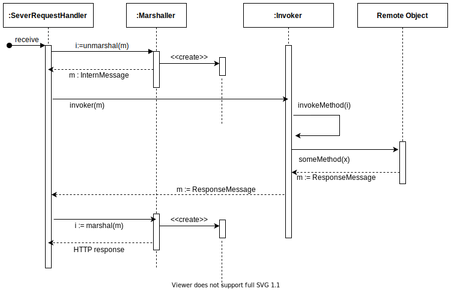

# Autumn
Autumn is a simple middleware implementation based on JSON. This middleware
uses a Thread-per-connection strategy to accept requests. Each request generates a new thread. The max number of active threads is the half capacity of the machine.

## Dependencies

- Java `>=` 11

## Architecture

Autumn contains four main patterns that is responsible to receive requests,
manager threads and call the correct resources. The patterns are Server
Request Handler, Invoker, Marshaller and Remote Object. For more details
about these patters, please see **VOLTER, Markus; KIRCHER, Michael; ZDUN,
Uwe. Remoting patterns. John Wiley & Sons, 2005**. The flux among these
patterns can be seen in the figure below:



## How to use Autumn
It is possible to implement a new system inside the Autumn repository. For this,
you need to create a new package in `src.main.java.application` and
implement your system calling the Autumn middleware. If you wish to use
Autumn middleware in another project, you need following these steps:

* Create a new Maven project
* Copy the folder `src.main.java.middleware` to your project
* Use the Autumn middleware

### How to init an application

To use Autumn, you need to create controllers with Autumn annotation. After this,
you need to create a main class that inits the Autumn and passes all controllers
to the middleware object. For this, use the method `addMethods` from Autumn.
See this example for more details:

```java
public class ApplicationRegistration {
    public static void main (String[] args){
        ApplicationUserController applicationUserController = new ApplicationUserController();
        Autumn server = new Autumn();
        server.addMethods(applicationUserController);
        server.start(7080);
    }
}
```
### How to create a controller

To create a controller, you need to annotate the controller class with `@RequestMap` and pass a route `@RequestMap(router='/')`. Each method in this controller
will be called with the prefix given to route param. See the example below:


```java
@RequestMap(router = "/calc")
public class CalculatorController {

    @Get(router = "/add")
    public JSONObject add(JSONObject jsonObject) throws Throwable {
        ...
    }
}
```
In this example, we create a controller named `CalculatorController` mapped
on the route `/calc` and create a method `get` on the route `/add`. So, if
you need to call this get method, you will send an HTTP request to the route
`/calc/add`. All routes need to be unique.

#### How to define routes in a controller
Autumn is based on JSON. Thus, all methods in a controller need to receive and return
a `JSONObject`. Autumn allow defines routes for the methods GET, POST, PUT e
DELETE, another HTTP method is not accepted. Bellow, we demonstrate how to create
a method to get all users from a database and return the result mapped on the route
`/list`. Note that the HTTP request body need contains an **empty JSON** to this request to work correctly. See more examples in `src.main.java.application`

```java
@Get(router = "/list")
public JSONObject getAllUsers(JSONObject jsonObject){
    ArrayList<ApplicationUser> users = applicationUserService.listAllUsers();
    
    JSONObject result = new JSONObject();
    result.put("users", users);

    return result;
}
```